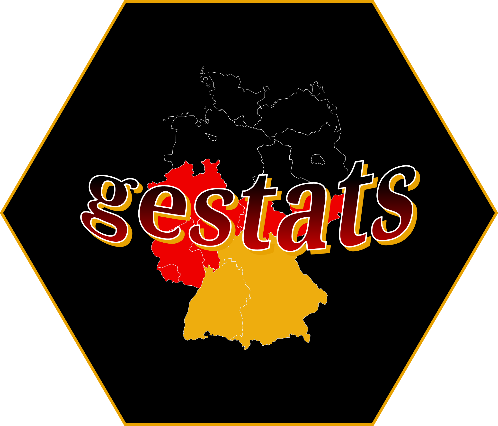

# gestats 

## Overview

This package will provide statistics and data about germany. Data (CSV files) is retrieved from the Federal Statistical Office of Germany ([Statistisches Bundesamt](https://www-genesis.destatis.de/genesis/online)).

## How to use

The file [topics](data/topics.md) contains all topics that are covered. Each directory contains at least three files:

- *xxx-RAW.csv* (raw, untranslated material)
- *GE-k.k-xxx.csv* (translated data)
- *GE-k.k-Information.txt* (important information, units, size of CSV file)

## Help

If you need help, take a deeper look into the [manual](https://github.com/BenSt099/gestats) (not yet available)
or open an [issue](https://github.com/BenSt099/gestats/issues).

## License

This project is licensed under MIT License.